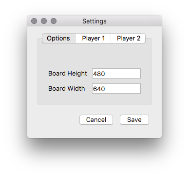

# PongP
Pong for python using pygame and hopefully tensorflow. This game is
based on [Siraj's pong neural network](https://github.com/llSourcell/pong_neural_network_live)
and [video](https://youtu.be/Hqf__FlRlzg).


## Install pygame
```commandline
pip3 install pygame --user
pip3 install pyqt5 --user
```
## Run pong
```commandline
python3 pong.py
```
Use the `spacebar` to start / re-start a game and use `r` to reset the score board.

For continuous play hit `c`.

## Game Settings

To display game settings, hit `s`.

