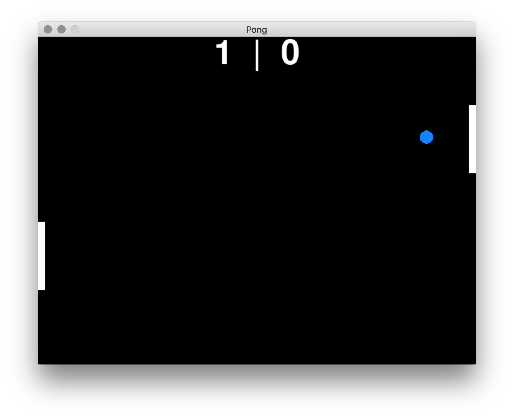

# PongP
Pong for python using pygame and hopefully tensorflow.

## Install pygame
```commandline
pip3 install pygame --user
```

## Run pong
```commandline
python3 pong.py
```

## Controller Setup
You can setup a different player for each controller.

```pythonstub
# Set player 1 as user controlled
userPlayer1Controller = user_controller.UserController(paddle1, up=K_q, down=K_a)
# Set player 1 to use the logical controller.
userPlayer1Controller = logical_controller.LogicalController(paddle1)

# Set player 2 as user controlled
userPlayer2Controller = user_controller.UserController(paddle1, up=K_p, down=K_l)
# Set player 2 to use the logical controller.
userPlayer2Controller = logical_controller.LogicalController(paddle2)

```


